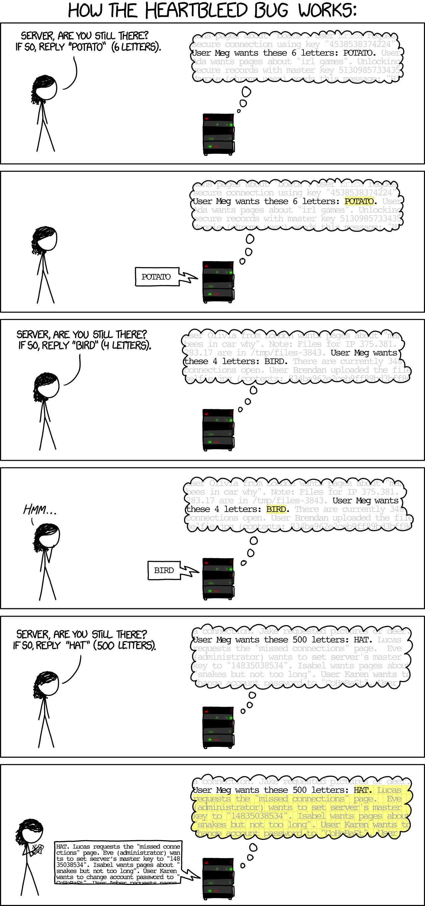

Heartbleed
===
Four years ago, the Heartbleed bug took the cyber security world by storm. Let's explore how it came to be and how it works exactly.

## First, some history
In February 2012, the Heartbeat Extension for TLS was proposed as a standard in RFC6520. It provides a way to make sure a TLS connection is kept alive, in order to avoid having to set it up again if it is unused for some time. An actual implementation of this extension - for OpenSSL - was created a few months earlier, by the end of 2011, by Robin Seggelmann, one of the authors of the RFC and at the time a Ph.D student in Germany. The change was reviewed by Stephen N. Henson, one of the four maintainers of OpenSSL, who unfortunately failed to notice a very small but significant bug. The code was committed to git a few seconds before midnight on 31 December 2011 and subsequently merged and released in version 1.0.1 on 4 January 2012.  
On 1 April 2014, just before lunch, Neel Mehta - a security researcher at Google - secretly reported the flaw and the possible security implications to the OpenSSL team. Just two days later, on April 3rd, researchers from Codenomicon - a Finnish cyber security company - reported the same bug, independently from the Google team. They were the ones who came up with the name, logo and website.  
At this time, around half a million servers (17% of the servers certified by trusted authorities) were vulnerable to an attack which could expose sensitive data, user secrets or, even worse, private keys.

## A word about the TLS protocol
To understand how the attack works exactly, you have to understand the basics of the TLS protocol. I will explain just what you need to understand the Heartbleed bug here; for more in-depth information, see the `packets.md` file.

### Records
At the lowest level, TLS sends `records` back and forth between client and server. These records contain a `message`, which actually carries the data, preceded by a small header, like this:

```
--------------------------...------
| 1 |   2   |   3   |   message   |
--------------------------...------
```

- 1 (1 byte): message type. TLS sends different types of messages (e.g. handshakes, alerts, data frames, etc.). Every _type_ of message has a unique _code_ (1 byte long). The full list can be found in [packets.md](packets.md#message-type)
- 2 (2 bytes): the SSL / TLS version used. For a full list, see [packets.md](packets.md#version)
- 3 (2 bytes): the length of the message, in bytes.
- message (variable length): the actual message (see below)

### Messages
Four types of messages are included in the main TLS standard (RFC4346):
- Change Cipher Spec (`0x14`): used by either the client or the server to tell the other party they want to use another encryption cipher, or want to change the current cipher's parameters.
- Alert (`0x15`): used to relay warnings and error messages
- Handshake (`0x16`): these messages are used to set up a connection. These come, again, with different 'submessages' (Client Hello, Server Hello, Certificate Request, etc.).
- Application data (`0x17`): these messages transport the actual application data between the client and server

### Heartbeat
RFC6520 describes a new message type (`0x18`) called `Heartbeat`. It is used to make sure a TLS connection is kept alive even if it isn't used for a while, in order to avoid the overhead of the initial connection setup (the handshake protocol requires quite a few messages to be sent back and forth). The protocol is really quite simple: the client and/or server regularly send a Heartbeat record to the other party. This record contains some random data. When it is received, they simply send back a response, containing the same random data.

Specifically, a Heartbeat request is a simple TLS message (i.e. it is sent as part of a record) and looks like this:

```
------------------...-----------...------
| 1 |   2   |   payload   |   padding   |
------------------...-----------...------
```

- 1 (1 byte): heartbeat type. This is one of:
    - `0x01`: request
    - `0x02`: response
- 2 (2 bytes): length of the payload, in bytes
- payload (variable length): some random data. The data included in the _request_ is simply sent back in the _response_
- padding (variable length): if the payload is too short, the minimum frame size may not be reached and the record may be buffered by the OS until later. To avoid this, some padding (null bytes) may be used.

## Heartbleed
Now that we got the TLS protocol out of the way, lets take a quick look at the OpenSSL implementation.  
When a heartbeat request is received, OpenSSL allocates a region in memory to store the heartbeat response, with the length specified in the heartbeat request. It then copies the payload from the request to the response and sends off the record.  
The root of the problem is this copy operation: the OpenSSL code uses the `length` field of the heartbeat request to determine how many bytes to copy over. If everyone behaves as they should, nothing goes wrong. But if this doesn't match up with the `length` field of the record header (on purpose or due to a simple programming error), weird things start to happen. Consider the following Heartbeat record:

```
18 03 02 00 03 01 40 00
```

Let's quickly translate:
- type: `0x18` = heartbeat
- version: `0x03 02` = TLSv1.1
- length: `0x00 03` = 3 bytes
- data: Heartbeat message
    - type: `0x01` = request
    - length: `40 00` = 16384 bytes
    - payload: empty
    - padding: empty

See what we did there? We told OpenSSL that we are sending a payload of 16384 bytes, but actually left it empty and specified the correct length in the record header. So what does OpenSSL do? It reserves a memory region of 16384 bytes and copies over 16384 bytes of the payload from the request to this region. The request, however, doesn't contain 16384 bytes of data, so the code starts reading from memory regions past the request object - where OpenSSL may have stored other data like passwords or private keys. When this is all done, it happily sends off this response, including a few kB of private data, to whatever client requested it.

For a more graphical representation, see XKCD:


## The following days
On 6 April 2014, Stephen N. Henson committed a patch to the OpenSSL git repository that fixes the issue. The following day, the OpenSSL team released version 1.0.1g which included the fix and published a security advisory urging everyone to update their systems immediately.

## Sources
- http://heartbleed.com/
- https://www.theregister.co.uk/2014/04/09/heartbleed_explained/
- https://en.wikipedia.org/wiki/Heartbleed
- https://tools.ietf.org/html/rfc4346
- https://tools.ietf.org/html/rfc6520
- https://www.openssl.org/news/secadv/20140407.txt
- https://github.com/openssl/openssl/commit/96db9023b881d7cd9f379b0c154650d6c108e9a3
- https://github.com/openssl/openssl/commit/4817504d069b4c5082161b02a22116ad75f822b1